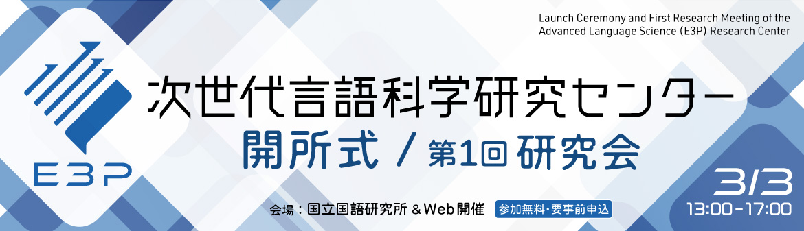

## Universal Dependencies 研究会 / Universal Dependencies Research Meeting

### 2025年度: Universal Dependencies 研究会

- 日時： 2025年9月20日 (土) 13:30-16:30

- 場所： 国立国語研究所 2F 多目的室 もしくは講堂

- 参加費： 無料　（要　参加申込）

- プログラム：
  - 13:30-13:40 趣旨説明　国立国語研究所 浅原正幸
  - 13:40-14:20 「」九州大学 伊藤薫
  - 14:20-15:00 「」大阪樟蔭女子大学 大村舞
  - 15:10-15:50 「」東京農工大学 尾崎太亮
  - 15:50-16:30 「指示応答プロンプトによる依存構造解析タスクのファインチューニング」Megagon Labs 松田寛

- 参加申込：
